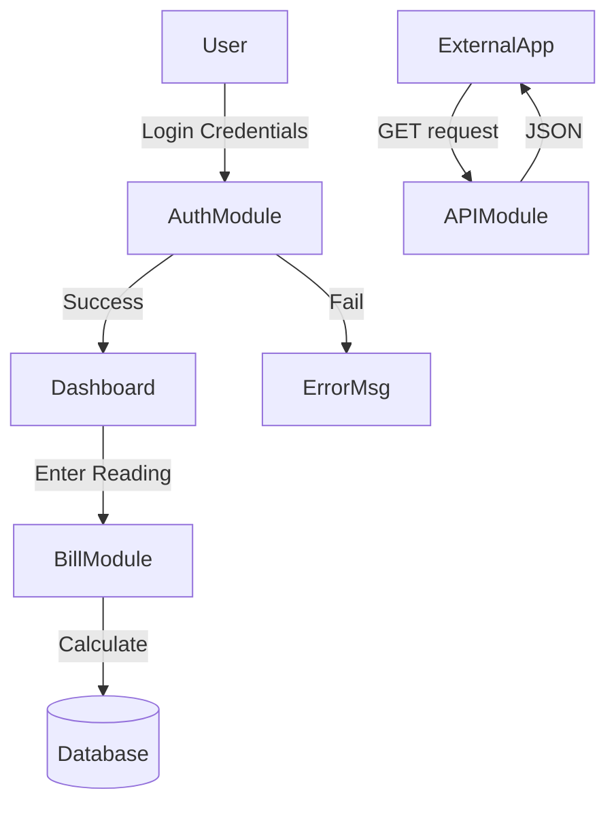

# ARG Module Specifications

## 1. Authentication Module

### 1.1 Login Functionality
- **Module Name**: `attemptsLogin` (in `login.php` / `functions.php`)
- **Input**: `email` (string), `password` (string)
- **Preconditions**: database connection established.
- **Logic**:
    1.  Sanitize inputs.
    2.  Query `employees` table for email.
    3.  If found, verify password (equality check in current version).
    4.  If valid, set `$_SESSION` variables (`user_id`, `role`).
    5.  Return success or error message.
- **Output**: Boolean (Success/Fail) or Error String.

## 2. Bill Generation Module

### 2.1 Calculate Bill
- **Module Name**: `calculateBill`
- **Input**: `units_consumed` (int), `connection_type` (string)
- **Preconditions**: Valid meter reading.
- **Logic (Pseudo Code)**:
    ```
    FUNCTION CalculateBill(units, type)
        IF type IS "HOUSEHOLD" THEN
            minCharge = 25
            IF units <= 50 THEN amt = units * 1.5
            ELSE IF units <= 100 THEN amt = (50 * 1.5) + ((units - 50) * 2.5)
            ELSE IF units <= 150 THEN amt = (50 * 1.5) + (100 * 2.5) + ((units - 100) * 3.5)
            ELSE amt = (50 * 1.5) + (100 * 2.5) + (50 * 3.5) + ((units - 150) * 4.5)
        
        ELSE IF type IS "COMMERCIAL" THEN
            minCharge = 50
            IF units <= 50 THEN amt = units * 2.5
            ELSE IF units <= 100 THEN amt = (50 * 2.5) + ((units - 50) * 3.5)
            ELSE IF units <= 150 THEN amt = (50 * 2.5) + (100 * 3.5) + ((units - 100) * 4.5)
            ELSE amt = (50 * 2.5) + (100 * 3.5) + (50 * 4.5) + ((units - 150) * 5.5)

        ELSE (INDUSTRY)
            minCharge = 100
            IF units <= 50 THEN amt = units * 3.5
            ELSE IF units <= 100 THEN amt = (50 * 3.5) + ((units - 50) * 4.5)
            ELSE IF units <= 150 THEN amt = (50 * 3.5) + (100 * 4.5) + ((units - 100) * 5.5)
            ELSE amt = (50 * 3.5) + (100 * 4.5) + (50 * 5.5) + ((units - 150) * 6.5)
        END IF

        IF units == 0 THEN RETURN minCharge
        ELSE RETURN amt
    END FUNCTION
    ```
- **Output**: Float (Total Amount).

## 3. API Module

### 3.1 Get Bill
- **Module Name**: `api/get_bill.php`
- **Input**: `service_number` OR `bill_no`.
- **Preconditions**: URL parameter presence.
- **Logic**:
    1.  Check for parameters.
    2.  Query `bills` joined with `users`.
    3.  Fetch latest bill if service number provided.
    4.  Format date and due date.
    5.  Return JSON.
- **Output**: JSON Object.

## Diagram (Mermaid)


